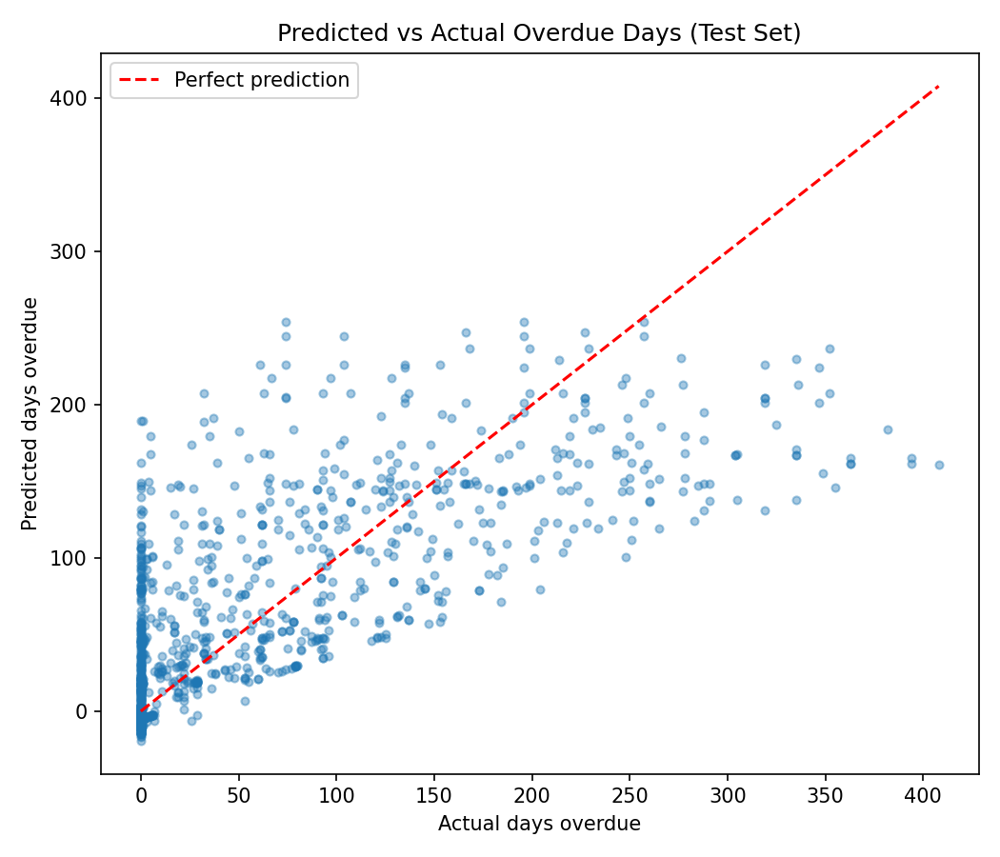

# Invoice Overdue-Days Prediction

Predicting how many days overdue an invoice will become, using a customer's
billing history and complaint behavior — a multiple linear regression
approach to accounts-receivable risk scoring.

## Problem

Collections teams want to prioritize outreach on invoices likely to become
seriously overdue, ideally before they age too far. This project builds a
regression model that estimates the eventual overdue duration (in days) of
an invoice at/near issue time, using the customer's historical payment and
complaint patterns.

## Dataset

5,000 invoice records from a B2B billing dataset (142 raw columns), covering:
- Invoice details (amount, dates, days to pay)
- Customer complaint/request percentages
- 12-month transaction history (count, dollar value, payment-status mix)

**Target:** `New_Due_Stage` — days overdue the invoice ultimately reached
(0 = paid on time; max observed = 408 days).

## A data quality issue I found and fixed

The raw dataset stores several groups of percentage columns that are shares
of the same whole and **sum to exactly 1 for every row** (e.g.
`Pct_Complains` + `Pct_Com_Sugg` + `Pct_Request` = 1, and similarly across
the four `Pct_*_Num12` payment-status columns). Including all of them as
features causes severe multicollinearity — confirmed via a correlation
check, which showed perfect (1.0) pairwise correlation within each group.

The first version of this model included all of them and produced
coefficients in the thousands, which is a clear sign something was wrong,
not a sign of strong effects. After dropping the redundant columns and
keeping one representative from each group, predictive performance (R²,
RMSE) was unchanged, confirming the dropped columns were adding noise and
instability rather than real signal.

This is the kind of check that matters more than the model itself.

## Approach

1. **Features used:** Invoice amount, historical days-to-pay, complaint
   rate, 12-month transaction count/value, and share of invoices that
   reached the worst delinquency bucket.
2. **Split:** 70/30 train/test.
3. **Scaling:** Standardized features before fitting, so coefficient
   magnitudes are comparable across features on very different scales.
4. **Model:** Ordinary least squares linear regression (`scikit-learn`).

## Results

| Metric | Value |
|---|---|
| RMSE | 50.4 days |
| MAE | 30.6 days |
| R² | 0.60 |

The model explains ~60% of the variance in eventual overdue duration. The
predicted-vs-actual plot below shows it tracks the overall trend well for
low-to-moderate overdue invoices, but **underestimates the most severe
delinquencies** (300+ days) — a real limitation worth flagging rather than
a result to round up. A non-linear model (e.g. gradient boosting) or
explicit interaction terms would likely close some of that gap; that's a
natural next step.



### What mattered most

After removing the collinear duplicates, the strongest standardized
predictors were:

- **Days_To_Pay** (historical) — unsurprisingly, customers who have been
  slow to pay before tend to be slow again.
- **Dol_Tran_12 / Num_Tran_12** — transaction volume and value over the
  trailing 12 months.
- **Pct_Complains** — customers with a higher share of billing complaints
  trend toward longer overdue periods.

## How to run

```bash
pip install pandas numpy scikit-learn matplotlib
python regression_model.py
```

## What I'd do next

- Try a non-linear model (random forest / gradient boosting) to capture
  the under-prediction at the high-delinquency tail.
- Engineer interaction features (e.g. invoice amount × historical days-to-pay).
- Treat this as a classification problem too ("will this go >90 days
  overdue, yes/no") since that may be the more actionable framing for a
  collections team than an exact day count.
