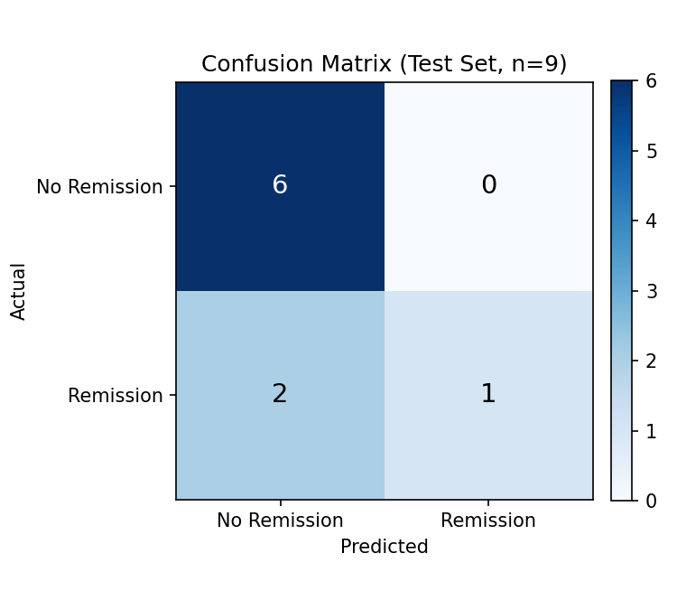

# Leukemia Remission Prediction — Logistic Regression

Predicting whether a leukemia patient achieves complete remission from six
clinical and laboratory measurements taken at diagnosis, using logistic
regression. A classic small-sample biostatistics dataset, used here to
practice classification modeling and to demonstrate why evaluation method
matters as much as the model itself when sample size is small.

## Problem

Given a patient's marrow cellularity, blast percentages, labeling index,
and pre-treatment temperature, can we predict whether they'll achieve
complete remission? This is the well-known 27-patient leukemia remission
dataset used widely in biostatistics teaching (SAS, Minitab, Penn State
STAT 501) to demonstrate logistic regression.

**Target:** `Remiss` — 1 if complete remission occurred, 0 otherwise (9
remission cases out of 27 patients).

**Predictors:** `Cell` (marrow clot cellularity), `Smear` (blast smear
differential %), `Infil` (marrow leukemia cell infiltrate %), `Li`
(labeling index), `Blast` (peripheral blood blast count), `Temp` (highest
pre-treatment temperature).

## A data quality issue I found and fixed

The CSV I started with had every decimal point silently replaced by a
minus sign somewhere upstream — `0.8` had become `-8`, `0.996` had become
`-996`, and so on (values ≥ 1, like a `Cell` reading of exactly `1`, were
unaffected, which is why the corruption wasn't obvious at a glance).

I confirmed this by comparing against the original published version of
this dataset (it appears in SAS/STAT and Penn State's STAT 501
documentation) and verified that every one of the 27 rows matched exactly
once the decimal points were restored. The file also had the same 27 rows
repeated four times to pad it to 108 rows — I used only the 27 unique
patients.

Modeling on the corrupted values directly would have produced a model
fitting an arbitrary sign-flip artifact rather than real clinical
relationships — worth catching before drawing any conclusions from it.

## Approach

1. **Target/features split:** `Remiss` as `y`, the six clinical measures as `X`.
2. **Train/test split:** 70/30, stratified on the target (important with
   only 9 positive cases total) and with a fixed random seed for
   reproducibility.
3. **Model:** Logistic regression (`scikit-learn`).
4. **Evaluation:** Confusion matrix, accuracy, precision/recall — plus
   Leave-One-Out Cross-Validation (LOOCV), explained below.

## Why I added Leave-One-Out Cross-Validation

With only 27 patients, a single 70/30 split tests on just ~8 people. The
reported accuracy can swing significantly depending on which patients
happen to land in the test set by chance — a real limitation worth naming
rather than glossing over.

LOOCV trains on 26 patients and predicts the 1 left out, repeated 27 times
so every patient is used as a test case exactly once. It's a far more
stable estimate when the sample size is this small.

## Results

| Evaluation method | Accuracy |
|---|---|
| Single 70/30 split (n=9 test) | 77.8% |
| Leave-One-Out CV (n=27, all patients) | **70.4%** |

The gap between these two numbers is the point: the single-split accuracy
looks better but is based on a lucky 9-patient sample. The LOOCV number is
the more trustworthy estimate of how this model would perform on a new
patient.



### What mattered most

The strongest predictor, by coefficient magnitude, was **Li (labeling
index)** — the percentage of labeled leukemia cells in the bone marrow.
This matches what's reported in the statistics literature for this exact
dataset, which gave me good confidence the decimal-point reconstruction
was correct.

## How to run

```bash
pip install pandas numpy scikit-learn matplotlib
python logistic_regression_model.py
```

## What I'd do next

- With only 27 patients, a more robust model (e.g. regularized logistic
  regression / Ridge or Lasso) would help guard against overfitting on so
  few observations.
- Recall on the "Remission" class (33–50% depending on evaluation method)
  is the real weak point — the model misses more remission cases than it
  catches. For a clinical use case, that's the metric to prioritize
  improving, not overall accuracy.
- A larger, modern dataset would let this be revisited with more
  confidence; this project is really a study in small-sample classification
  discipline as much as it is about leukemia specifically.
