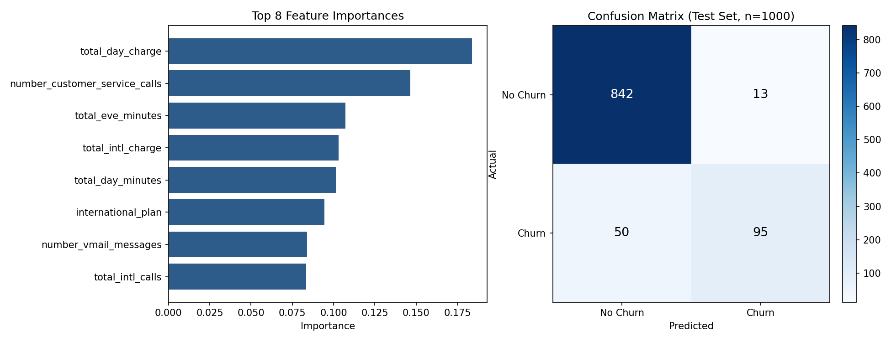

# Telecom Customer Churn Prediction — Decision Tree

Predicting which telecom customers are likely to churn (cancel their
service), using usage patterns and plan details — and a closer look at
why "accuracy" alone is a misleading metric on imbalanced data like this.

## Problem

A telecom provider wants to flag customers likely to churn so retention
teams can act before they leave. Given call minutes/charges across day,
evening, night, and international usage, plan details (international
plan, voicemail plan), and customer service call history, can we predict
churn?

**Target:** `churn` (yes/no) — 483 churned out of 3,333 customers (14.5%).

**Dropped columns:** `state` and `area_code` — these describe where a
customer is located, not how they use the service, so they're not
meaningful churn drivers and risk the model leaning on a geography proxy
instead of real usage signals.

## Why accuracy alone is the wrong headline metric here

Only 14.5% of customers in this dataset churn. That means a model that
**always predicts "no churn"** — without learning anything at all — would
already score **85.5% accuracy**. A reported accuracy needs to be read
against that baseline, not in isolation.

This is why the results below lead with **balanced accuracy** and
**per-class precision/recall**, not just overall accuracy.

## Approach

1. **Encoding:** Label-encoded `churn`, `international_plan`, and
   `voice_mail_plan` (binary categories).
2. **Split:** 70/30, **stratified** on churn — with only 483 churn cases
   total, an unstratified split risks an unrepresentative test set.
3. **Model:** Decision tree classifier (`max_depth=6` to limit
   overfitting on a tree that could otherwise grow to perfectly memorize
   the training set).
4. **Evaluation:** Confusion matrix, accuracy, balanced accuracy,
   precision/recall/F1 per class, and 5-fold cross-validation for a more
   stable estimate than a single split.

## Results

| Metric | Value |
|---|---|
| Accuracy | 93.7% |
| Balanced accuracy | 82.0% |
| Churn class — precision | 88% |
| Churn class — recall | 66% |
| 5-fold CV balanced accuracy | 84.4% (± 1.1%) |



**The headline accuracy (93.7%) looks great but overstates how good the
model is at the thing that actually matters: catching churners.** Balanced
accuracy (82.0%) and churn recall (66%) tell the more honest story — the
model misses **1 in 3 customers who actually churn** (50 false negatives
out of 145 actual churners in the test set). For a retention team, those
50 missed customers are the ones who walk out the door with no
intervention attempt — that's the number to focus on improving, not the
93.7% headline.

### What drives churn, according to the model

The top predictors were `total_day_charge`, `number_customer_service_calls`,
and `total_eve_minutes`. The customer-service-calls signal makes strong
business sense — customers who call support repeatedly are often already
frustrated, which is a classic churn precursor worth flagging operationally,
independent of any model.

## How to run

```bash
pip install pandas numpy scikit-learn matplotlib
python decision_tree_model.py
```

## What I'd do next

- Try class-weighting (`class_weight="balanced"`) or resampling (SMOTE) to
  directly address the imbalance and push churn recall higher, likely at
  some cost to precision — worth exploring that tradeoff explicitly.
- Compare against a random forest or gradient-boosted tree, which usually
  outperform a single decision tree on tabular data like this.
- Tune `max_depth` and `min_samples_leaf` via grid search rather than a
  fixed depth chosen by inspection.
