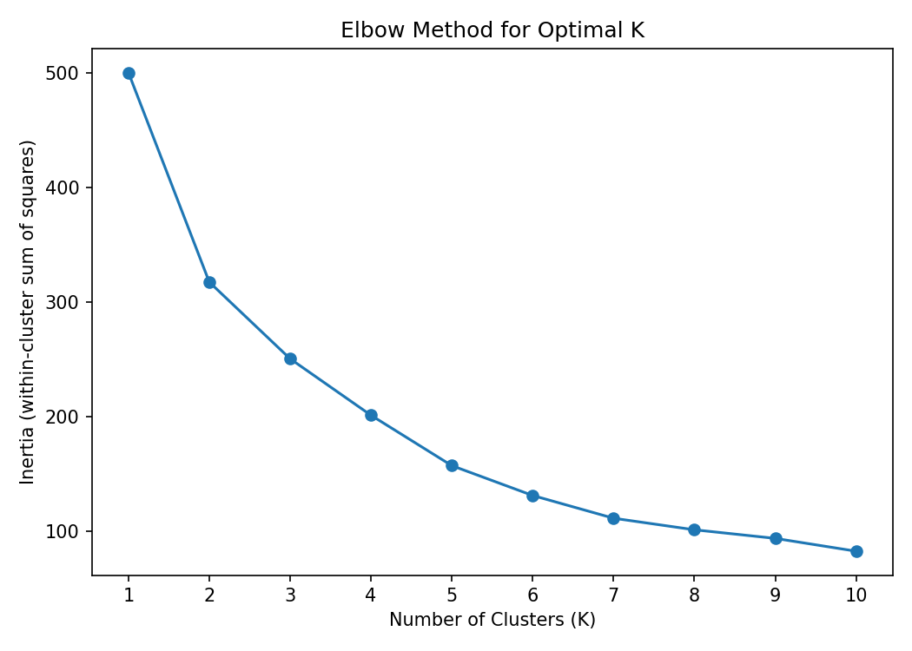
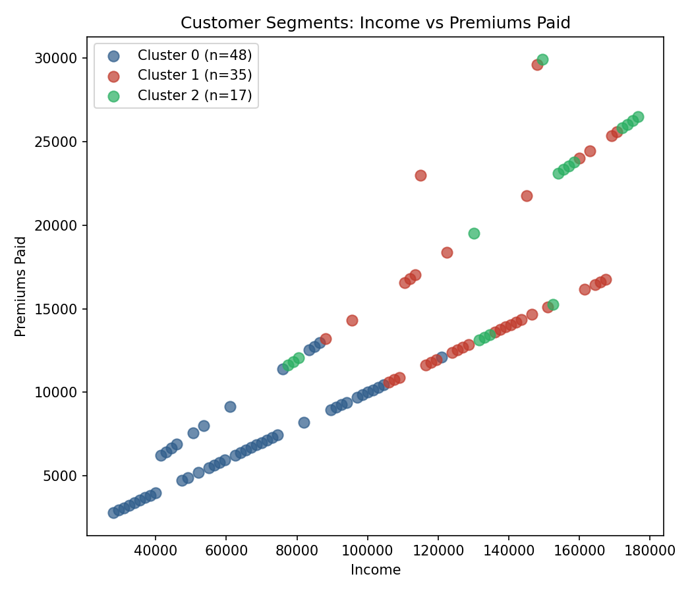

# Insurance Customer Segmentation — K-Means Clustering

Segmenting insurance customers into meaningful groups based on premiums,
age, renewal timing, claims history, and income — with no labeled target.
This is unsupervised learning: the goal isn't to predict anything, it's to
discover structure that wasn't visible at a glance.

## Problem

An insurer wants to understand whether its customer base breaks down into
natural segments — for example, to target retention efforts or pricing
differently by group. Given 100 customers described by 5 continuous
attributes, can K-Means clustering reveal meaningful segments?

**Data:** `Premiums Paid`, `Age`, `Days to Renew`, `Claims made`, `Income`
— 100 customers, no missing values, no categorical encoding needed.

## Approach

1. **Standardization:** Scaled all 5 features to mean 0, std 1 before
   clustering. Without this, `Income` (tens of thousands) and `Claims
   made` would dominate the distance calculation purely because of their
   larger numeric scale — the clusters would really just be "income
   clusters" wearing a disguise, not a balanced view across all 5
   attributes.
2. **Choosing K — the elbow method:** Plotted inertia (within-cluster
   sum of squares) for K = 1 to 10.
3. **Final model:** K-Means with K=3, fixed `random_state` and `n_init=10`
   for reproducibility (K-Means' results can otherwise shift slightly
   between runs due to random centroid initialization).
4. **Profiling clusters in original units** — not standardized values.
   This sounds minor but matters a lot: grouping by cluster on the
   *scaled* data gives means like `-1.44`, which means nothing to a
   business stakeholder. Profiling on the original dataframe gives real
   premium amounts, real ages, real income — numbers someone can act on.



**Honest read of the elbow:** the bend at K=3 is visible but not sharp —
inertia keeps falling steadily afterward rather than flattening abruptly.
K=4 would be a defensible alternative. I chose K=3 because it produced
the most business-interpretable, distinct segments (see below), not
because the elbow plot alone made the answer obvious.

## Results — 3 customer segments

| Cluster | Customers | Avg Premium | Avg Age | Avg Days to Renew | Avg Claims | Avg Income |
|---|---|---|---|---|---|---|
| 0 | 48 | $7,252 | 39.6 | 116.7 | $6,439 | $65,531 |
| 1 | 35 | $16,221 | 49.8 | 68.1 | $10,206 | $133,986 |
| 2 | 17 | $19,906 | 57.0 | 238.5 | $34,801 | $140,588 |



### Reading the segments

- **Cluster 0 — "Standard, lower-income":** Largest group (48 customers).
  Lower premiums and income, closer to renewal on average, modest claims.
- **Cluster 1 — "Higher-income, engaged":** Higher premiums and income,
  the shortest average time to renewal (68 days) — these customers renew
  more frequently, suggesting either shorter policy terms or more active
  engagement.
- **Cluster 2 — "High-value, high-risk":** Smallest group (17 customers,
  highest income and premiums) but by far the **highest average claims
  ($34,801 — over 3x Cluster 1)** and the **longest time to renewal (238
  days)**. This is the most actionable segment from a business
  standpoint: high-value customers who are also the highest claims risk
  and aren't close to a renewal touchpoint — worth proactive outreach
  rather than waiting for renewal season.

The scatter plot (Income vs Premiums Paid) shows the clusters separate
reasonably well along that diagonal, but overlap somewhat in the middle —
expected, since clustering happened across all 5 dimensions and this plot
only shows 2 of them.

## A second check: silhouette score tells a different story than the elbow

I went back and computed silhouette scores (a measure of how well-separated
clusters are, from -1 to 1, higher is better) for K=2 through K=5, since I'd
already flagged the elbow bend as not fully conclusive:

| K | Silhouette Score |
|---|---|
| 2 | **0.397** |
| 3 | 0.290 |
| 4 | 0.303 |
| 5 | 0.321 |

This says something the elbow plot didn't make obvious: **K=2 actually
produces the most well-separated clusters**, not K=3. I'm reporting this
rather than quietly switching to K=2 and rewriting the story, because this
is a genuinely common situation in clustering — different validation
methods can disagree, and presenting only the one that confirms your
initial choice would be misleading.

I kept the K=3 profile above because three segments map onto a more
actionable business story (standard / engaged / high-value-high-risk) than
a 2-way split would, but a rigorous next step before using this in
production would be to inspect the K=2 segmentation directly and decide
which split is more useful operationally — geometric separation and
business interpretability aren't always the same thing, and that tension
is worth naming rather than picking whichever number sounds more
sophisticated.

## How to run

```bash
pip install pandas numpy scikit-learn matplotlib
python kmeans_model.py
```

## What I'd do next

- Inspect the K=2 segmentation directly, given it scored highest on
  silhouette — see whether a 2-way split still captures the
  high-claims/long-renewal group as a distinguishable pattern within one
  of the two clusters.
- Visualize all 5 dimensions together via PCA (2 principal components) to
  see cluster separation more faithfully than any single 2-feature slice
  can show.
- If this were a real production segmentation, validate cluster stability
  by re-running with bootstrapped samples of the 100 customers, since a
  dataset this small means any single clustering result carries real
  sampling uncertainty.
