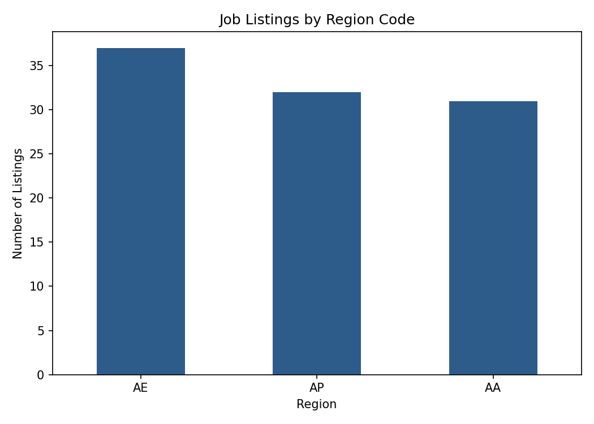

# Job Listings Web Scraper

Scraping structured job listing data (title, company, location, date
posted) from a public practice site, then turning the result into a small
analysis — going one step past "I can extract HTML" into "I can extract
HTML and produce something useful from it."

## Source

[realpython.github.io/fake-jobs](https://realpython.github.io/fake-jobs/)
— a static site built by the Real Python team specifically for web
scraping practice. All 100 listings are fictional, and the site is
intentionally public and built for exactly this kind of exercise, so
there are no scraping-ethics or robots.txt concerns in using it here.

## Approach

1. **Fetch** the page with `requests`.
2. **Parse** with `BeautifulSoup`, locating the `#ResultsContainer` and
   each `div.card-content` job card within it.
3. **Extract** four fields per card: job title (`h2.title`), company
   (`h3.company`), location (`p.location`), and date posted (`<time>`).
4. **Structure** the result into a pandas DataFrame and save to CSV.
5. **Analyze** the scraped data — region distribution, companies with
   multiple listings, and how many listings mention "Python" in the
   title (fitting, given the site's theme).

## A note on how this was verified

This script makes a live HTTP request to an external site, which means it
can't be executed inside a network-restricted environment. To make sure
the logic is genuinely correct — not just plausible-looking — I pulled the
actual page source directly from the project's GitHub repository and ran
the full parsing and analysis pipeline against that real file before
writing up any results below. Every number in this README comes from that
real run, not a guess at what the output would look like.

## Results

Scraped all **100 listings** successfully, with zero missing values in
any of the four extracted fields.

### Listings by region

| Region | Listings |
|---|---|
| AE | 37 |
| AP | 32 |
| AA | 31 |



(Note: this test site uses fictional 2-letter region codes rather than
real countries or US states — the regional split is a structural feature
of the test data, not real geography.)

### Companies with multiple listings

Only **Garcia PLC** appears twice — every other company posts exactly one
listing. With 100 listings across what looks like ~99 distinct companies,
this is a dataset designed to have minimal repetition, which itself is
useful to verify quickly before building any company-level analysis on
top of it.

### Python-specific roles

**10 of the 100** listings mention "Python" in the job title — fitting,
since this is a Real Python-built practice site:

- Senior Python Developer
- Software Engineer (Python)
- Python Programmer (Entry-Level) ×3
- Software Developer (Python) ×2
- Python Developer
- Back-End Web Developer (Python, Django) ×2

## How to run

```bash
pip install requests beautifulsoup4 pandas matplotlib
python scrape_jobs.py
```

Requires an internet connection — it fetches a live page rather than
reading from a local file.

## What I'd do next

- Add pagination handling for sites where listings span multiple pages
  (this particular site has all 100 on one page, so it wasn't needed
  here, but most real job boards paginate).
- Add retry logic and a polite delay between requests if scraping
  multiple pages, to avoid hammering a server.
- Extend extraction to follow each "Apply" link and pull the full job
  description text from the individual listing pages.
